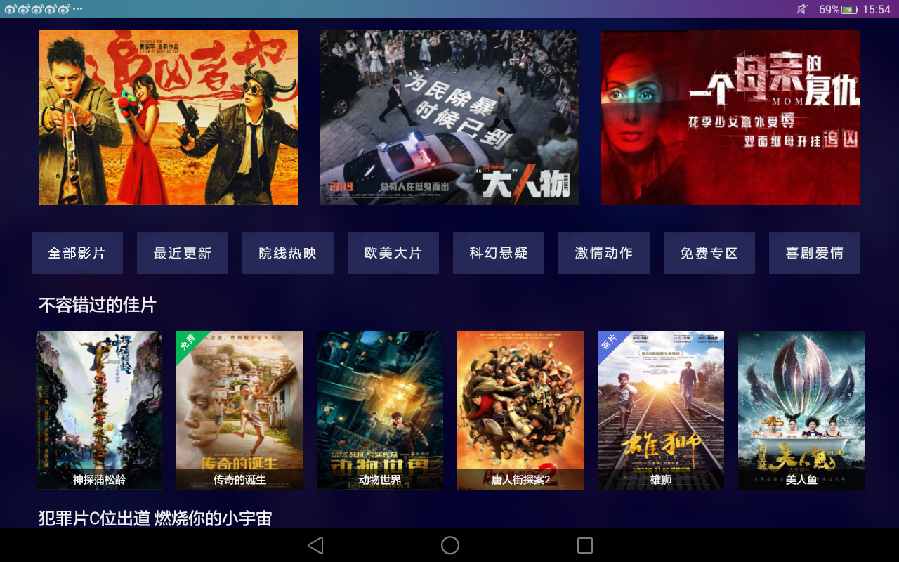
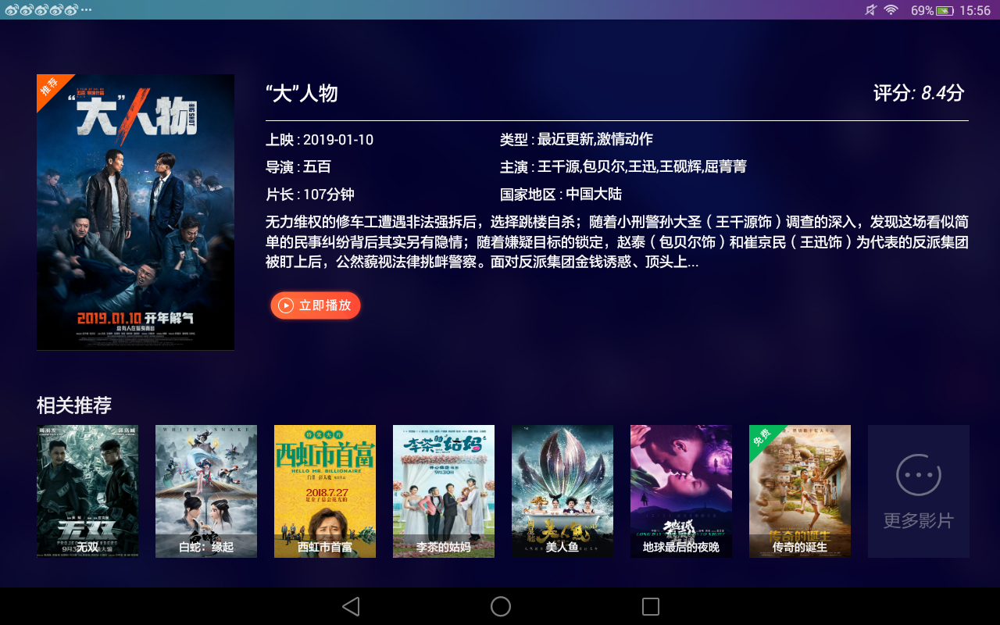
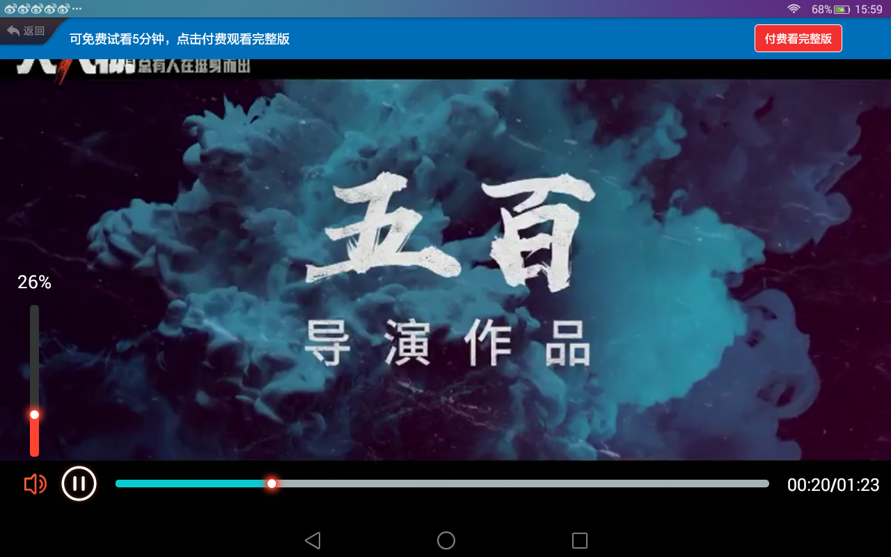

# VideoPlayer
这是一个基于ijkplayer实现的一款AndroidTV视频播放器。对ijkplayer提供的so库进行了更改，让其能适配更多的视频格式。该项目适配触屏版本和TV版本。

效果如下：
1.视频列表界面，该界面根据不同类型将影片分类展示，当遥控板选中某部影片时，会出现放大的效果。

2.影片详情界面

3.视频播放界面。包括快进，快退，暂停，播放， 声音控制等

项目适配了市场上大部分的TV,这也是第一次开发TV项目，在这过程中遇到很多坑，遇到最多的就是遥控板焦点处理的问题。今天将项目中的部分代码抽取出来整理成一个demo，但整个播放流程是完整的。希望和大家一起学习，一起进步。
